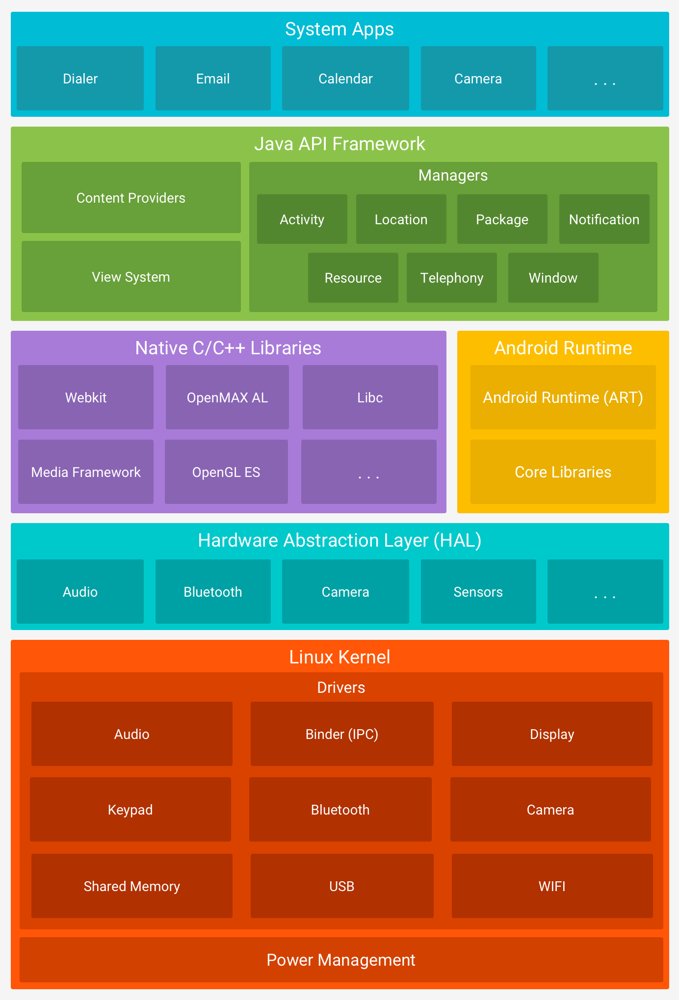

# Android Architecture: Complete Layer-by-Layer Guide

A comprehensive visual and technical guide to the Android system architecture, based on the official Android stack diagram. Each layer is explained with its components, purpose, and why it exists in the architecture.

---

## Table of Contents

1. [Architecture Overview](#1-architecture-overview)
2. [Layer 1: System Apps](#2-layer-1-system-apps)
3. [Layer 2: Java API Framework](#3-layer-2-java-api-framework)
4. [Layer 3: Native C/C++ Libraries](#4-layer-3-native-cc-libraries)
5. [Layer 4: Android Runtime (ART)](#5-layer-4-android-runtime-art)
6. [Layer 5: Hardware Abstraction Layer (HAL)](#6-layer-5-hardware-abstraction-layer-hal)
7. [Layer 6: Linux Kernel](#7-layer-6-linux-kernel)
8. [Service vs Manager vs System Service vs Native Service](#8-service-vs-manager-vs-system-service-vs-native-service)
9. [Cross-Layer Communication Flow](#9-cross-layer-communication-flow)
10. [Why This Architecture Exists](#10-why-this-architecture-exists)

---


---

## 1. Architecture Overview

The Android platform is organized into a **layered stack** where each layer provides specific services to the layer above it. This design ensures modularity, security, and portability across thousands of different hardware devices.

```
┌─────────────────────────────────────────────────────────────────────┐
│ LAYER 1: SYSTEM APPS                                                │
│  Dialer, Email, Calendar, Camera, Browser, Third-Party Apps          │
├─────────────────────────────────────────────────────────────────────┤
│ LAYER 2: JAVA API FRAMEWORK                                           │
│  ┌─────────────────┐ ┌─────────────────────────────────────────────┐  │
│  │ Content Providers│ │ Managers: Activity, Location, Package,    │  │
│  │                  │ │ Notification, Resource, Telephony, Window  │  │
│  ├─────────────────┤ ├─────────────────────────────────────────────┤  │
│  │ View System      │ │                                            │  │
│  └─────────────────┘ └─────────────────────────────────────────────┘  │
├─────────────────────────────────────────────────────────────────────┤
│ LAYER 3 & 4: SYSTEM RUNTIME                                         │
│  ┌──────────────────────────────────┐ ┌──────────────────────────┐ │
│  │ NATIVE C/C++ LIBRARIES            │ │ ANDROID RUNTIME (ART)    │ │
│  │ ┌────────┐ ┌────────┐ ┌────────┐ │ │ ┌──────────────────────┐ │ │
│  │ │ Webkit │ │OpenMAX │ │ Libc   │ │ │ │ Android Runtime      │ │ │
│  │ │        │ │  AL    │ │        │ │ │ │ (ART)                │ │ │
│  │ ├────────┤ ├────────┤ ├────────┤ │ │ ├──────────────────────┤ │ │
│  │ │ Media  │ │OpenGL  │ │  ...   │ │ │ │ Core Libraries       │ │ │
│  │ │Framework│ │  ES   │ │        │ │ │ │ (java.lang,          │ │ │
│  │ └────────┘ └────────┘ └────────┘ │ │ │ java.util, etc.)     │ │ │
│  └──────────────────────────────────┘ └──────────────────────────┘ │
├─────────────────────────────────────────────────────────────────────┤
│ LAYER 5: HARDWARE ABSTRACTION LAYER (HAL)                             │
│  ┌────────┐ ┌────────┐ ┌────────┐ ┌────────┐ ┌────────┐          │
│  │ Audio  │ │Bluetooth│ │ Camera │ │ Sensors│ │  ...   │          │
│  └────────┘ └────────┘ └────────┘ └────────┘ └────────┘          │
├─────────────────────────────────────────────────────────────────────┤
│ LAYER 6: LINUX KERNEL                                                 │
│  ┌─────────────────────────────────────────────────────────────┐    │
│  │ DRIVERS: Audio, Binder (IPC), Display, Keypad, Bluetooth,   │    │
│  │ Camera, Shared Memory, USB, WiFi, ...                       │    │
│  ├─────────────────────────────────────────────────────────────┤    │
│  │ POWER MANAGEMENT                                             │    │
│  └─────────────────────────────────────────────────────────────┘    │
└─────────────────────────────────────────────────────────────────────┘
```

---

## 2. Layer 1: System Apps

### What It Is

The topmost layer of the Android stack. This is where all applications live — both the apps that come pre-installed with the device and the apps that users download from the Play Store or install manually.

### Components in This Layer

| Component            | Type       | Purpose                                                    |
| -------------------- | ---------- | ---------------------------------------------------------- |
| **Dialer**           | System App | Handles phone calls, contact lookup, call history          |
| **Email**            | System App | Email client for managing accounts (Gmail, Exchange, etc.) |
| **Calendar**         | System App | Schedule management, reminders, event notifications        |
| **Camera**           | System App | Photo/video capture, gallery integration                   |
| **Browser**          | System App | Web content rendering (Chrome, WebView-based browsers)     |
| **Settings**         | System App | Device configuration, permissions, system preferences      |
| **Third-Party Apps** | User Apps  | Instagram, Spotify, WhatsApp, games, productivity tools    |

### Why This Layer Exists

- **User Interaction**: This is the only layer users directly see and interact with
- **Sandboxing**: Each app runs in its own isolated Linux process with a unique UID, preventing one app from accessing another's data
- **Permission Model**: Apps must request permissions to access sensitive resources (camera, location, contacts)
- **Modularity**: Apps can be installed, updated, and removed independently without affecting the system

### Key Characteristics

- Written in **Java** or **Kotlin**
- Packaged as **APK** or **AAB** files
- No direct hardware access — must use APIs from the Framework layer below
- Each app runs in its own **Dalvik/ART virtual machine instance**

---

## 3. Layer 2: Java API Framework

### What It Is

The middle layer that provides all the APIs, services, and tools developers use to build Android applications. It sits between the apps and the lower-level native/runtime layers, acting as the primary interface for app development.

### Components in This Layer

#### 3.1 Content Providers

| Component             | Purpose                                                      |
| --------------------- | ------------------------------------------------------------ |
| **Content Providers** | Enable secure data sharing between different applications using a URI-based permission model. Apps can expose their data (contacts, photos, calendar) to other apps without direct file access. |

**Why it exists:** Without Content Providers, apps would need direct file system access to share data, breaking the security sandbox model. Content Providers enforce permissions and provide a standardized query interface (CRUD operations via URIs).

**Example:** The Contacts app exposes contact data via `content://com.android.contacts/contacts`. WhatsApp can read contacts through this URI without accessing the Contacts app's private files directly.

#### 3.2 View System

| Component       | Purpose                                                      |
| --------------- | ------------------------------------------------------------ |
| **View System** | Provides all UI components (widgets) for building app interfaces. Handles layout inflation, measurement, drawing, and touch event dispatch. |

**Why it exists:** Apps need a standardized way to create user interfaces. The View System abstracts display differences (screen sizes, densities, orientations) so developers write UI code once and it works across all devices.

**Components:**

- `TextView` — displays text
- `Button` — clickable actions
- `ListView` / `RecyclerView` — scrollable lists
- `WebView` — embedded web browser
- `ImageView` — image display
- `ConstraintLayout` / `LinearLayout` / `RelativeLayout` — layout containers

#### 3.3 Managers

Managers are the primary API classes that apps use to request system services. Each Manager corresponds to a System Service running in the background.

| Manager                  | Purpose                                                      | What It Controls                                             |
| ------------------------ | ------------------------------------------------------------ | ------------------------------------------------------------ |
| **Activity Manager**     | Manages the lifecycle of all activities (screens) in the system. Handles app launching, pausing, resuming, and the back stack navigation. | App lifecycle, task management, memory cleanup               |
| **Location Manager**     | Provides access to location services (GPS, Wi-Fi, cellular triangulation). | Geographic positioning, navigation, geofencing               |
| **Package Manager**      | Manages all installed applications. Knows every app's permissions, components, and version. | App installation, uninstallation, updates, permission verification |
| **Notification Manager** | Allows apps to display alerts in the status bar, lock screen, and as heads-up notifications. | User alerts, background task completion, incoming messages   |
| **Resource Manager**     | Manages non-code resources: strings, images, layouts, colors, animations. | Localization, theme switching, screen density adaptation     |
| **Telephony Manager**    | Provides information about the device's cellular connection. | SIM state, network type (4G/5G), signal strength, phone number |
| **Window Manager**       | Manages all windows (surfaces) displayed on the screen. Coordinates with SurfaceFlinger below. | Window positioning, z-order, animations, dialog management   |

**Why Managers exist:**

- **Abstraction**: Apps don't need to know how location hardware works — they just call `LocationManager.requestLocationUpdates()`
- **Security**: Managers validate permissions before granting access to sensitive resources
- **Resource Sharing**: Multiple apps can use the camera through `CameraManager`, which coordinates access so only one app uses it at a time
- **Consistency**: All apps use the same APIs, ensuring consistent behavior across the ecosystem

### Why This Layer Exists

- **Developer Productivity**: Provides high-level APIs so developers don't write low-level hardware code
- **Security Enforcement**: Every API call can be gated by permissions checked at this layer
- **Hardware Abstraction**: Apps work on any Android device regardless of underlying hardware differences
- **System Integration**: Apps can participate in system-wide behaviors (notifications, sharing, multitasking)

### Key Characteristics

- Written in **Java** and increasingly **Kotlin**
- Lives in `/system/framework/framework.jar`
- Uses **AIDL (Android Interface Definition Language)** to communicate with System Services
- Provides both **Public APIs** (for all developers) and **System APIs** (for system apps only)

---

## 4. Layer 3: Native C/C++ Libraries

### What It Is

A collection of pre-compiled libraries written in C and C++ that provide core functionalities to the Android system. These libraries are exposed to Java apps through the Android Framework via JNI (Java Native Interface).

### Components in This Layer

| Library                   | Purpose                                                      | Why It Exists                                                |
| ------------------------- | ------------------------------------------------------------ | ------------------------------------------------------------ |
| **WebKit**                | Web rendering engine for displaying HTML, CSS, and JavaScript content. Powers the built-in browser and WebView component. | Apps need to display web content. WebKit provides a full browser engine without requiring each app to bundle its own. |
| **OpenMAX AL**            | Cross-platform multimedia API for low-latency audio/video processing. Provides standardized access to codecs and media hardware. | Real-time media processing (voice commands, live camera feeds) needs direct hardware access with minimal latency. OpenMAX AL abstracts codec differences across vendors. |
| **Libc (Bionic)**         | Android's custom C standard library. Provides system calls, memory management, threading, and file I/O. | Standard glibc is too large for mobile devices. Bionic is optimized for low memory footprint and fast performance on ARM processors. |
| **Media Framework**       | Collection of codecs and media processing libraries (Stagefright, NuPlayer, ExoPlayer). Supports MP3, MP4, AAC, H.264, H.265, VP9. | Apps need to play and record audio/video in many formats. The Media Framework handles format detection, decoding, and synchronization. |
| **OpenGL ES**             | 3D graphics API for embedded systems. Enables GPU-accelerated 2D/3D rendering. | Games, maps, and animated UIs need hardware-accelerated graphics. OpenGL ES provides a standard API that works across all GPU vendors (Qualcomm, Mali, PowerVR). |
| **SQLite**                | Lightweight relational database engine.                      | Apps need persistent structured data storage. SQLite provides SQL capabilities without requiring a separate database server process. |
| **SSL / TLS (BoringSSL)** | Cryptographic library for secure network communication.      | All modern apps use HTTPS. BoringSSL (Google's fork of OpenSSL) provides encryption, certificate validation, and secure connections. |
| **FreeType**              | Font rendering engine.                                       | Text must be rendered crisply at all screen sizes and resolutions. FreeType handles TrueType, OpenType, and bitmap fonts. |
| **Surface Manager**       | Display compositor that manages graphics buffers.            | Multiple apps draw to separate buffers. Surface Manager composites them into the final screen image, handling transparency, overlays, and hardware acceleration. |

### Why This Layer Exists

- **Performance**: C/C++ code runs faster than Java for compute-intensive tasks (graphics, media, crypto)
- **Memory Efficiency**: Native libraries have lower memory overhead than Java equivalents
- **Hardware Acceleration**: Direct GPU and DSP access requires native code
- **Code Reuse**: Many of these libraries (OpenGL, SQLite, WebKit) are industry standards used across platforms
- **No GC Overhead**: Native code doesn't trigger Java garbage collection pauses, critical for real-time audio/video

### Key Characteristics

- Compiled as **shared libraries (.so files)** in `/system/lib/` and `/system/lib64/`
- Accessed by Java code through **JNI (Java Native Interface)**
- Written in **C and C++**
- Run in the same process as the calling app (for app-accessible libraries) or as separate services (for system libraries)

---

## 5. Layer 4: Android Runtime (ART)

### What It Is

The execution environment that runs all Android applications. ART is the successor to the Dalvik Virtual Machine and is responsible for converting app bytecode into machine code that the device's processor can execute.

### Components in This Layer

| Component                  | Purpose                                                      | Why It Exists                                                |
| -------------------------- | ------------------------------------------------------------ | ------------------------------------------------------------ |
| **Android Runtime (ART)**  | The virtual machine that executes Android apps. Replaced Dalvik in Android 5.0 (Lollipop). | Apps are written in Java/Kotlin but CPUs only understand machine code. ART bridges this gap by compiling and executing bytecode. |
| **Core Libraries**         | Implementation of standard Java APIs (`java.lang`, `java.util`, `java.io`, `java.net`, etc.) | Developers expect standard Java functionality. Core Libraries provide these APIs optimized for mobile constraints. |
| **AOT Compiler (dex2oat)** | Compiles app bytecode (DEX files) into native machine code at install time. | Pre-compilation eliminates runtime compilation overhead, making apps start faster and run more efficiently. |
| **JIT Compiler**           | Fallback compilation for code paths that weren't pre-compiled. | Some dynamic code can't be pre-compiled. JIT handles these cases at runtime with minimal overhead. |
| **Garbage Collector**      | Automatically reclaims memory from objects no longer in use. | Manual memory management is error-prone. GC prevents memory leaks while apps run, though it can cause brief pauses. |
| **Debugger (JDWP)**        | Supports debugging apps from Android Studio.                 | Developers need to set breakpoints, inspect variables, and step through code. JDWP provides this capability. |

### Why ART Exists (vs Dalvik)

| Aspect             | Dalvik (Android 1.0–4.4)           | ART (Android 5.0+)             |
| ------------------ | ---------------------------------- | ------------------------------ |
| **Compilation**    | JIT — compiled every time app runs | AOT — compiled once at install |
| **Startup Speed**  | Slow — must compile on launch      | Fast — code is already native  |
| **Runtime Speed**  | Slower — compilation overhead      | Faster — pure native execution |
| **Memory Usage**   | Lower footprint                    | Higher footprint (cached code) |
| **Battery Impact** | Higher CPU drain                   | More efficient                 |
| **Install Time**   | Fast                               | Slower (compilation happens)   |

**Why Google switched from Dalvik to ART:**

- Mobile users expect instant app launches — AOT compilation delivers this
- Battery life is critical — eliminating runtime compilation saves power
- Games and animations need consistent frame rates — JIT compilation caused stuttering
- Storage became cheaper than battery life — trading disk space for performance was worthwhile

### Key Characteristics

- Each app runs in its own **ART instance** within a separate Linux process
- ART is **register-based** (not stack-based like JVM) — optimized for ARM processors
- Uses **.dex (Dalvik Executable)** format instead of Java's .class files
- Compiled output stored as **.oat (Optimized Android Executable)** files in `/data/dalvik-cache/`

---

## 6. Layer 5: Hardware Abstraction Layer (HAL)

### What It Is

The interface between the Android operating system and the device's physical hardware. HAL provides a standardized contract that hardware vendors implement, allowing Android to work with any hardware without modifying the upper layers.

### Components in This Layer

| HAL Module        | Hardware Controlled                                          | Why It Exists                                                |
| ----------------- | ------------------------------------------------------------ | ------------------------------------------------------------ |
| **Audio HAL**     | Speakers, microphones, headphone jack, audio routing         | Different audio chips (Qualcomm, Cirrus Logic, Realtek) have different register sets. HAL abstracts these differences so the Media Framework works uniformly. |
| **Bluetooth HAL** | Bluetooth chip, BLE (Low Energy), protocols                  | Bluetooth chips from different vendors (Broadcom, Qualcomm, MediaTek) implement the BT stack differently. HAL provides a single `IBluetooth` interface. |
| **Camera HAL**    | Camera sensor, ISP (Image Signal Processor), flash, autofocus | Camera hardware varies enormously (Sony IMX, Samsung ISOCELL, OmniVision). HAL lets the Camera Framework use any sensor without code changes. |
| **Sensors HAL**   | Accelerometer, gyroscope, magnetometer, barometer, light, proximity | Sensor vendors (Bosch, STMicroelectronics, InvenSense) use different communication protocols (I2C, SPI). HAL normalizes data formats and sampling rates. |
| **Display HAL**   | Screen panel, GPU composer, HDMI output                      | Display panels (LCD, OLED, AMOLED) and GPU architectures vary. HAL handles mode setting, buffer allocation, and vsync synchronization. |
| **GPS HAL**       | GNSS receiver (GPS, GLONASS, Galileo)                        | GPS chipsets (Qualcomm, Broadcom, u-blox) output NMEA or proprietary binary formats. HAL parses these into standard location objects. |
| **Wi-Fi HAL**     | WLAN chip, hotspot, scanning                                 | Wi-Fi chips (Qualcomm, Broadcom, MediaTek) have different firmware interfaces. HAL provides standard `IWifi` methods for connection, scanning, and tethering. |
| **NFC HAL**       | Near-field communication controller                          | NFC chips (NXP, Broadcom) handle card emulation, reader mode, and P2P differently. HAL standardizes these modes for payment apps (Google Pay). |
| **Power HAL**     | CPU frequency scaling, thermal management, sleep states      | Different SoCs have different power domains and thermal zones. HAL lets the Power Manager optimize battery without knowing chip specifics. |
| **Vibrator HAL**  | Haptic motor (ERM or LRA)                                    | Vibration motors have different drive circuits. HAL abstracts PWM/GPIO control so apps can vibrate consistently. |

### Why This Layer Exists

- **Hardware Independence**: Android can run on thousands of different devices without code changes to the Framework
- **IP Protection**: Vendors write proprietary HAL implementations (.so files) without open-sourcing their driver code
- **Parallel Development**: Google and OEMs can develop independently — Google updates the Framework while OEMs update HALs
- **OTA Updates**: Android system updates don't require recompiling vendor code (Project Treble, Android 8.0+)
- **Testing**: Hardware and software teams can test against the HAL interface separately

### HAL Architecture

```
┌─────────────────────────────────────────┐
│ Android Framework / Native Service        │
│     (Java / C++ code)                     │
├─────────────────────────────────────────┤
│ HAL Interface (Google-defined AIDL)       │
│   e.g., IVibrator.aidl, ICamera.aidl      │
├─────────────────────────────────────────┤
│ HAL Implementation (Vendor .so)           │
│   (Proprietary vendor code)               │
├─────────────────────────────────────────┤
│ Linux Kernel Driver                         │
│   (Open source or binary blob)            │
├─────────────────────────────────────────┤
│ Physical Hardware                           │
└─────────────────────────────────────────┘
```

### Key Characteristics

- Written in **C and C++**
- Implemented as **shared libraries (.so files)** in `/vendor/lib/hw/` or `/vendor/lib64/hw/`
- Interface defined by **Google** in AOSP; **implementation by vendors**
- Communicates with kernel drivers via **sysfs, IOCTL, or direct memory mapping**

---

## 7. Layer 6: Linux Kernel

### What It Is

The foundation of the entire Android operating system. Android uses a modified Linux kernel that handles all hardware interactions, process management, memory management, and security enforcement.

### Components in This Layer

#### 7.1 Drivers

Drivers are kernel modules that directly control hardware components. They translate generic kernel commands into device-specific operations.

| Driver                   | Hardware Controlled              | Why It Exists                                                |
| ------------------------ | -------------------------------- | ------------------------------------------------------------ |
| **Audio Driver**         | Sound card, microphone, speakers | Converts digital audio data to analog signals (and vice versa). Handles sample rates, bit depths, and audio routing. |
| **Binder (IPC) Driver**  | Inter-process communication      | Android's most important kernel addition. Enables secure, high-performance communication between apps and system services. Without Binder, apps couldn't use the Framework APIs. |
| **Display Driver**       | Screen panel, framebuffer        | Controls pixel output, resolution, refresh rate, and color calibration. Manages the framebuffer memory that the GPU writes to. |
| **Keypad Driver**        | Physical buttons, touch keys     | Translates electrical signals from buttons into key events that the Input System can process. |
| **Bluetooth Driver**     | Bluetooth chip                   | Manages HCI (Host Controller Interface) communication with the BT chip. Handles firmware loading and power management. |
| **Camera Driver**        | Camera sensor, ISP               | Controls sensor exposure, focus, and data readout. Manages DMA transfers of image data from sensor to memory. |
| **Shared Memory Driver** | Ashmem (Android Shared Memory)   | Allows multiple processes to share memory regions efficiently. Critical for SurfaceFlinger to share graphics buffers with apps. |
| **USB Driver**           | USB controller, OTG              | Handles USB device enumeration, power delivery, and data transfer. Supports host mode (OTG) and device mode (MTP, ADB). |
| **WiFi Driver**          | WLAN chip                        | Manages 802.11 protocol implementation, scanning, association, and encryption. Interfaces with wpa_supplicant for authentication. |

#### 7.2 Power Management

| Component            | Purpose                                                      | Why It Exists                                                |
| -------------------- | ------------------------------------------------------------ | ------------------------------------------------------------ |
| **Power Management** | Controls CPU frequency scaling, sleep/wake states, battery charging, and thermal throttling. | Mobile devices have limited battery. Power Management ensures the device only uses full power when needed, extending battery life from hours to days. |
| **WakeLocks**        | Keep the device awake for critical tasks (music playback, GPS navigation, phone calls). | Without WakeLocks, the device would sleep immediately when the screen turns off, interrupting background tasks. WakeLocks allow fine-grained power control. |
| **CPU Governors**    | Algorithms that decide CPU frequency (performance, powersave, ondemand, interactive). | Different workloads need different CPU speeds. Governors balance responsiveness (high frequency) vs battery life (low frequency). |

### Android-Specific Kernel Modifications

| Feature               | Standard Linux                  | Android Modification                                 | Why                                                          |
| --------------------- | ------------------------------- | ---------------------------------------------------- | ------------------------------------------------------------ |
| **Binder IPC**        | Uses POSIX IPC (pipes, sockets) | Custom kernel driver for high-performance IPC        | Standard IPC is too slow for Android's frequent cross-process calls. Binder uses shared memory for zero-copy data transfer. |
| **Ashmem**            | Standard shared memory          | Anonymous shared memory with reference counting      | Graphics buffers and large bitmaps need efficient sharing between apps and SurfaceFlinger. |
| **Low Memory Killer** | OOM (Out of Memory) killer      | Proactive process killing before memory is exhausted | Mobile devices can't swap to disk. LMK kills background apps early to keep foreground apps responsive. |
| **Alarm Driver**      | Standard timer                  | Wakes device from deep sleep for scheduled tasks     | Phones need to receive notifications and alarms even in deep sleep. The Alarm driver coordinates with the RTC. |
| **Logger**            | Syslog / journald               | Ring-buffer log (`logcat`)                           | `adb logcat` reads from the kernel ring buffer. Circular buffer prevents storage exhaustion on mobile devices. |
| **Paranoid Network**  | Standard network stack          | Per-UID network restrictions                         | Prevents apps from sniffing each other's traffic or accessing network interfaces without permission. |
| **Wakelocks**         | Standard suspend/resume         | Fine-grained power control                           | Servers don't need to sleep. Phones must sleep aggressively. Wakelocks allow selective wakefulness. |

### Why This Layer Exists

- **Hardware Control**: Only the kernel can directly access hardware registers and interrupts
- **Security Foundation**: The kernel enforces process isolation, file permissions, and SELinux policies
- **Resource Management**: Decides which process gets CPU time, how memory is allocated, and when devices sleep
- **Stability**: Linux is a mature, well-tested kernel with 30+ years of development
- **Open Source**: Aligns with Android's open-source philosophy and enables vendor customization

### Key Characteristics

- Written in **C**
- Runs in **kernel space** (privileged mode) — apps cannot directly access it
- Android kernel version typically lags mainline Linux by 1-2 years
- Configured with `CONFIG_ANDROID=y` to enable all Android-specific features

---

## 8. Service vs Manager vs System Service vs Native Service

### Understanding the Difference

In Android, the terms **Manager**, **Service**, **System Service**, and **Native Service** refer to different types of components with distinct roles, locations, and responsibilities. Understanding these differences is critical for understanding how Android works internally.

### Quick Comparison Table

| Component          | What It Is                               | Where It Lives              | Language    | Does Real Work?                 | Who Uses It                    |
| ------------------ | ---------------------------------------- | --------------------------- | ----------- | ------------------------------- | ------------------------------ |
| **Manager**        | Java API wrapper that apps call          | **Your app's process**      | Java/Kotlin | ❌ No — just forwards requests   | Apps (yours and third-party)   |
| **App Service**    | Background component in your app         | **Your app's process**      | Java/Kotlin | ✅ Yes, but only for your app    | Only your app                  |
| **System Service** | Core OS service running in system_server | **system_server process**   | Java + JNI  | ✅ Yes, system-wide coordination | All apps via Managers          |
| **Native Service** | Low-level C++ daemon process             | **Separate native process** | C/C++       | ✅ Yes, hardware-critical work   | System Services via JNI/Binder |

---

### 8.1 Manager (Client-Side API)

#### What It Is

A **Manager** is a Java class in the Android Framework that provides a clean, high-level API for apps to request system operations. It is the **client-side stub** that lives inside your app's process.

#### Key Characteristics

- Lives in **your app's process** (loaded from `/system/framework/framework.jar`)
- Written in **Java/Kotlin**
- Does **NOT** perform the actual work
- Sends **Binder IPC calls** to the real System Service
- Provides a **synchronous-looking API** that hides the asynchronous IPC underneath

#### Analogy

Think of a Manager as a **receptionist** at a doctor's office. You talk to the receptionist, but they don't treat you — they just pass your request to the actual doctor (System Service).

#### Example — VibratorManager

```java
// This code runs IN YOUR APP PROCESS
// The Manager is just a thin wrapper

VibratorManager vibratorManager = (VibratorManager) getSystemService(Context.VIBRATOR_MANAGER_SERVICE);

// This line sends a Binder IPC transaction to VibratorManagerService in system_server
// NO actual vibration happens in your app process!
vibratorManager.vibrate(VibrationEffect.createOneShot(500, VibrationEffect.DEFAULT_AMPLITUDE));
```

#### List of Common Managers

| Manager               | System Service It Talks To   | Purpose                      |
| --------------------- | ---------------------------- | ---------------------------- |
| `ActivityManager`     | `ActivityManagerService`     | App lifecycle, tasks, memory |
| `WindowManager`       | `WindowManagerService`       | Windows, z-order, input      |
| `PackageManager`      | `PackageManagerService`      | App install, permissions     |
| `NotificationManager` | `NotificationManagerService` | Status bar alerts            |
| `LocationManager`     | `LocationManagerService`     | GPS, positioning             |
| `CameraManager`       | `CameraService`              | Camera access                |
| `SensorManager`       | `SensorService`              | Hardware sensors             |
| `VibratorManager`     | `VibratorManagerService`     | Haptic feedback              |
| `PowerManager`        | `PowerManagerService`        | Wake locks, sleep            |
| `TelephonyManager`    | `TelephonyRegistry`          | SIM, network, calls          |

---

### 8.2 App Service (Your Background Component)

#### What It Is

An **App Service** is one of Android's four core application components (Activity, Service, BroadcastReceiver, ContentProvider). It performs long-running operations in the background without a user interface.

#### Key Characteristics

- Lives in **your app's process**
- Written in **Java/Kotlin**
- Performs **actual work** for your app only
- Can be **started** (runs indefinitely) or **bound** (provides IPC interface)
- Gets killed when your app is killed (unless it's a foreground service)

#### Analogy

Think of an App Service as **your own employee** — they work only for you, in your office (your app's process).

#### Example — Music Playback Service

```java
// This Service runs IN YOUR APP PROCESS
// It performs real work (playing music) but only for your app

public class MusicPlaybackService extends Service {
    private MediaPlayer mediaPlayer;

    @Override
    public int onStartCommand(Intent intent, int flags, int startId) {
        // This runs in YOUR app process, NOT in system_server
        mediaPlayer = new MediaPlayer();
        mediaPlayer.setDataSource("https://example.com/song.mp3");
        mediaPlayer.prepare();
        mediaPlayer.start();  // Actual audio playback happens here!

        // Make this a foreground service so it survives memory pressure
        startForeground(1, buildNotification());

        return START_STICKY;
    }

    @Override
    public void onDestroy() {
        mediaPlayer.stop();
        mediaPlayer.release();
    }
}
```

#### How to Use It

```java
// From your Activity
Intent intent = new Intent(this, MusicPlaybackService.class);
startService(intent);  // Service starts running in your app's process
```

---

### 8.3 System Service (The Real Implementation)

#### What It Is

A **System Service** is the **actual implementation** of a system feature that runs inside the **`system_server`** process. It receives requests from Managers via Binder IPC and performs the real system-level operations.

#### Key Characteristics

- Lives in the **`system_server` process** (shared with ~100+ other services)
- Written in **Java** with **JNI calls** to native code
- Performs **real work** — validates permissions, manages state, coordinates resources
- Started during **system boot** by `SystemServer.java`
- If it crashes, the entire system may restart (watchdog)

#### Analogy

Think of a System Service as the **department head** in a hospital. The receptionist (Manager) sends patients to them, and they actually make decisions, perform procedures, and delegate to specialists (Native Services).

#### Example — VibratorManagerService

```java
// This runs IN THE SYSTEM_SERVER PROCESS
// This is the REAL implementation that does the work

public class VibratorManagerService extends SystemService {

    // This stub receives Binder IPC calls from apps
    private final IVibratorManagerService.Stub mService = 
            new IVibratorManagerService.Stub() {

        @Override
        public void vibrate(int uid, String opPkg, 
                           CombinedVibration vibration, 
                           IBinder token, String reason) {

            // 1. VALIDATE PERMISSION (security check)
            mContext.enforceCallingPermission(
                android.Manifest.permission.VIBRATE, 
                "vibrate"
            );

            // 2. MANAGE STATE (track which app is vibrating)
            synchronized (mLock) {
                if (mCurrentVibration != null) {
                    mCurrentVibration.cancel();  // Cancel previous
                }
            }

            // 3. DELEGATE TO NATIVE LAYER (via JNI)
            for (VibratorController controller : mVibrators) {
                controller.vibrate(vibration);  // → JNI → Native HAL
            }
        }
    };
}
```

#### System Service Startup

```java
// SystemServer.java — called during Android boot
private void startOtherServices() {
    // ... other services ...

    // Start VibratorManagerService
    vibratorManagerService = new VibratorManagerService(mSystemContext);
    ServiceManager.addService("vibrator", vibratorManagerService);

    // ... more services ...
}
```

#### List of Major System Services

| System Service           | Manager           | What It Actually Does                                        |
| ------------------------ | ----------------- | ------------------------------------------------------------ |
| `ActivityManagerService` | `ActivityManager` | Starts/kills apps, manages tasks, detects ANRs, handles memory pressure |
| `WindowManagerService`   | `WindowManager`   | Composites all windows, handles input dispatch, manages display policy |
| `PackageManagerService`  | `PackageManager`  | Parses APKs, installs apps, grants permissions, verifies signatures |
| `VibratorManagerService` | `VibratorManager` | Coordinates vibration across multiple motors, enforces permissions |
| `CameraService`          | `CameraManager`   | Manages camera device policy, handles concurrent access, streams buffers |
| `InputManagerService`    | `InputManager`    | Reads touch/key events from kernel, dispatches to apps       |
| `PowerManagerService`    | `PowerManager`    | Manages wake locks, decides when device sleeps, controls brightness |
| `SensorService`          | `SensorManager`   | Polls hardware sensors, batches events, delivers to apps     |

---

### 8.4 Native Service (Low-Level Daemon)

#### What It Is

A **Native Service** is a standalone process written in **C/C++** that handles performance-critical or hardware-specific operations. It runs **outside** the Java `system_server` process for stability and performance reasons.

#### Key Characteristics

- Lives in a **separate native process** (e.g., `surfaceflinger`, `cameraserver`)
- Written in **C/C++**
- Has **direct HAL access** without JNI overhead
- If it crashes, **system_server survives** (isolation)
- Started by `init.rc` during boot

#### Analogy

Think of a Native Service as a **specialist technician** who works in their own workshop. They handle complex, time-sensitive tasks that require specialized tools (hardware access) and can't be interrupted by office distractions (Java GC).

#### Example — SurfaceFlinger (Display Compositor)

```cpp
// This runs IN A SEPARATE PROCESS called "surfaceflinger"
// It is NOT in system_server!

class SurfaceFlinger : public BnSurfaceComposer {
public:
    void doComposition() {
        // This must run at 60fps (16ms per frame)
        // Java GC pauses would cause visible stuttering!

        // 1. Collect all visible layers from all apps
        for (const auto& layer : mLayers) {
            layer->latchBuffer();  // Get latest buffer from app
        }

        // 2. Composite into final display buffer using GPU
        mRenderEngine->drawLayers(mLayers);

        // 3. Send to display via HAL
        mDisplayHardware->present(buffer);
    }
};
```

#### Native Service Startup (init.rc)

```bash
# This is defined in /system/etc/init/surfaceflinger.rc
service surfaceflinger /system/bin/surfaceflinger
    class core
    user system
    group graphics drmrpc
    onrestart restart zygote  # If SurfaceFlinger dies, restart Zygote
```

#### List of Key Native Services

| Native Service         | Process Name      | Role                                               | Why It's Native                            |
| ---------------------- | ----------------- | -------------------------------------------------- | ------------------------------------------ |
| `SurfaceFlinger`       | `surfaceflinger`  | Composites all app windows into the display buffer | Must run at 60fps without GC pauses        |
| `MediaServer`          | `mediaserver`     | Audio/video playback, codec management             | Real-time audio can't tolerate GC delays   |
| `CameraServer`         | `cameraserver`    | Camera HAL coordination, buffer management         | Direct DMA buffer access needs native code |
| `Vibrator HAL Service` | `vendor.vibrator` | Controls haptic hardware                           | Direct PWM/GPIO control                    |
| `DrmServer`            | `drmserver`       | DRM content protection (Netflix, Spotify)          | Security — keeps keys in native memory     |
| `Netd`                 | `netd`            | Network interface configuration, firewall          | Direct socket and iptables access          |

---

### 8.5 Summary: The Four Types Compared

```
┌─────────────────────────────────────────────────────────────────────────┐
│ YOUR APP PROCESS                                                        │
│ ┌─────────────────────────────────────────────────────────────────────┐ │
│ │ Manager (Java)                                                      │ │
│ │  • VibratorManager, CameraManager, LocationManager                  │ │
│ │  • Just a wrapper — sends Binder IPC calls                          │ │
│ │  • Lives in your app process                                        │ │
│ └─────────────────────────────────────────────────────────────────────┘ │
│ ┌─────────────────────────────────────────────────────────────────────┐ │
│ │ App Service (Java)                                                  │ │
│ │  • MusicPlaybackService, DownloadService                              │ │
│ │  • Does real work but only for your app                             │ │
│ │  • Lives in your app process                                        │ │
│ └─────────────────────────────────────────────────────────────────────┘ │
└─────────────────────────────────────────────────────────────────────────┘
                                    │
                                    ▼ Binder IPC
┌─────────────────────────────────────────────────────────────────────────┐
│ SYSTEM_SERVER PROCESS                                                   │
│ ┌─────────────────────────────────────────────────────────────────────┐ │
│ │ System Service (Java + JNI)                                         │ │
│ │  • VibratorManagerService, CameraService, ActivityManagerService    │ │
│ │  • Does real work, validates permissions, manages state             │ │
│ │  • Calls JNI to reach native layer                                  │ │
│ │  • Lives in system_server (shared with ~100 services)               │ │
│ └─────────────────────────────────────────────────────────────────────┘ │
└─────────────────────────────────────────────────────────────────────────┘
                                    │
                                    ▼ JNI / Binder IPC
┌─────────────────────────────────────────────────────────────────────────┐
│ SEPARATE NATIVE PROCESS                                                 │
│ ┌─────────────────────────────────────────────────────────────────────┐ │
│ │ Native Service (C++)                                                │ │
│ │  • SurfaceFlinger, CameraServer, MediaServer                        │ │
│ │  • Does hardware-critical work, direct HAL access                   │ │
│ │  • Lives in its own process (crash isolation)                       │ │
│ └─────────────────────────────────────────────────────────────────────┘ │
└─────────────────────────────────────────────────────────────────────────┘
```

---

## 9. Cross-Layer Communication Flow

### Two Cases: System Service Path vs Native Service Path

Not all hardware operations follow the same path through the Android stack. Some go through **System Services** in `system_server`, while others go directly to **Native Services** in separate processes. Here are the two cases:

---

### CASE 1: Path Through System Service (Vibrator Example)

This is the most common path. The app calls a Manager, which talks to a System Service in `system_server`, which then calls JNI to reach a Native HAL Service.

```
┌─────────────────────────────────────────────────────────────────────────┐
│ 1. APPLICATION LAYER (Your App)                                         │
│                                                                         │
│  User taps "Vibrate" button                                             │
│  Your app calls:                                                        │
│  VibratorManager vm = getSystemService(VIBRATOR_MANAGER_SERVICE);     │
│  vm.vibrate(effect);  // ← Manager sends Binder IPC                   │
│                                                                         │
│  [Process: com.example.yourapp]                                         │
│  [Language: Java/Kotlin]                                                │
│  [Does real work? NO — just forwards request]                           │
└─────────────────────────────────────────────────────────────────────────┘
                                    │
                                    ▼ Binder IPC (AIDL)
┌─────────────────────────────────────────────────────────────────────────┐
│ 2. JAVA API FRAMEWORK (Stub in your app)                                │
│                                                                         │
│  VibratorManager (Java stub)                                            │
│  └── Packages the request into a Parcel                                 │
│  └── Sends via Binder driver to system_server                           │
│                                                                         │
│  [Process: com.example.yourapp]                                         │
│  [Language: Java]                                                       │
│  [Does real work? NO — just serializes the call]                        │
└─────────────────────────────────────────────────────────────────────────┘
                                    │
                                    ▼ Binder IPC (kernel driver)
┌─────────────────────────────────────────────────────────────────────────┐
│ 3. SYSTEM SERVICES (system_server)                                       │
│                                                                         │
│  VibratorManagerService receives Binder call                            │
│  ├── enforcePermission(VIBRATE)  ← Security check!                      │
│  ├── Check if already vibrating                                         │
│  ├── Manage vibration state                                             │
│  └── Call JNI: nativeVibrate(duration)  ← Bridge to native layer        │
│                                                                         │
│  [Process: system_server]                                               │
│  [Language: Java + JNI]                                                 │
│  [Does real work? YES — validates, manages, delegates]                  │
└─────────────────────────────────────────────────────────────────────────┘
                                    │
                                    ▼ JNI (Java → C++ transition)
┌─────────────────────────────────────────────────────────────────────────┐
│ 4. NATIVE C/C++ LIBRARIES (JNI Bridge)                                  │
│                                                                         │
│  android_os_Vibrator.cpp (JNI implementation)                             │
│  ├── JNIEnv* env converts Java long → C++ int64_t                       │
│  ├── Get IVibrator service via ServiceManager                           │
│  └── Call: vibrator->on(milliseconds)  ← Native Binder IPC              │
│                                                                         │
│  [Library: libandroid_runtime.so]                                       │
│  [Language: C++]                                                        │
│  [Does real work? NO — just translates and forwards]                    │
└─────────────────────────────────────────────────────────────────────────┘
                                    │
                                    ▼ Binder IPC (Native AIDL)
┌─────────────────────────────────────────────────────────────────────────┐
│ 5. NATIVE SERVICE (Vendor Process)                                      │
│                                                                         │
│  Vibrator HAL Service (C++)                                             │
│  ├── BnVibrator implementation receives call                              │
│  ├── mHwApi->on(milliseconds)  ← HAL interface call                     │
│  └── Write to sysfs: /sys/class/timed_output/vibrator/enable            │
│                                                                         │
│  [Process: vendor.vibrator]                                             │
│  [Language: C++]                                                        │
│  [Does real work? YES — controls hardware]                              │
└─────────────────────────────────────────────────────────────────────────┘
                                    │
                                    ▼ Sysfs / IOCTL
┌─────────────────────────────────────────────────────────────────────────┐
│ 6. LINUX KERNEL                                                         │
│                                                                         │
│  Vibrator Driver (kernel module)                                        │
│  ├── Receive enable command via sysfs node                              │
│  ├── Set GPIO/PWM pin HIGH                                              │
│  ├── Start timer for duration (500ms)                                   │
│  └── Set GPIO LOW when timer expires                                    │
│                                                                         │
│  [Space: Kernel space]                                                  │
│  [Language: C]                                                          │
│  [Does real work? YES — direct hardware control]                        │
└─────────────────────────────────────────────────────────────────────────┘
                                    │
                                    ▼ Electrical signal
┌─────────────────────────────────────────────────────────────────────────┐
│ 7. PHYSICAL HARDWARE                                                    │
│                                                                         │
│  Haptic Motor (ERM or LRA)                                              │
│  ├── Receives voltage from GPIO/PWM                                     │
│  ├── Generates vibration for 500ms                                      │
│  └── Stops when signal removed                                          │
│                                                                         │
│  [Physical component on PCB]                                            │
│  [Does real work? YES — the actual vibration!]                          │
└─────────────────────────────────────────────────────────────────────────┘
```

**Summary of Case 1 (System Service Path):**

- **7 layers traversed** from app to hardware
- **2 IPC hops**: App → system_server → Native Service
- **JNI bridge** used at layer 4 to cross Java → C++ boundary
- **System Service** in `system_server` performs permission checks and state management

---

### CASE 2: Path Through Native Service (Media Playback Example)

Some operations bypass `system_server` entirely and go directly to a Native Service. This is used for performance-critical operations where the overhead of `system_server` would be unacceptable.

```
┌─────────────────────────────────────────────────────────────────────────┐
│ 1. APPLICATION LAYER (Your App)                                         │
│                                                                         │
│  User taps "Play" in Spotify                                            │
│  Your app calls:                                                        │
│  MediaPlayer player = new MediaPlayer();                                │
│  player.setDataSource("song.mp3");                                        │
│  player.start();  // ← Manager sends Binder IPC                         │
│                                                                         │
│  [Process: com.spotify.music]                                           │
│  [Language: Java/Kotlin]                                                │
│  [Does real work? NO — just forwards request]                           │
└─────────────────────────────────────────────────────────────────────────┘
                                    │
                                    ▼ Binder IPC (AIDL)
┌─────────────────────────────────────────────────────────────────────────┐
│ 2. JAVA API FRAMEWORK (Media Framework)                                 │
│                                                                         │
│  MediaPlayer (Java)                                                     │
│  └── JNI call to native MediaPlayer implementation                      │
│                                                                         │
│  [Process: com.spotify.music]                                           │
│  [Language: Java + JNI]                                                 │
│  [Does real work? NO — just forwards to native layer]                   │
└─────────────────────────────────────────────────────────────────────────┘
                                    │
                                    ▼ JNI (Java → C++)
┌─────────────────────────────────────────────────────────────────────────┐
│ 3. NATIVE C/C++ LIBRARIES (JNI Bridge)                                  │
│                                                                         │
│  android_media_MediaPlayer.cpp (JNI)                                    │
│  ├── Convert Java MediaPlayer object to native pointer                  │
│  └── Call native MediaPlayer methods                                    │
│                                                                         │
│  [Library: libmedia_jni.so]                                             │
│  [Language: C++]                                                        │
│  [Does real work? NO — just translates]                                  │
└─────────────────────────────────────────────────────────────────────────┘
                                    │
                                    ▼ Direct function call / Binder IPC
┌─────────────────────────────────────────────────────────────────────────┐
│ 4. NATIVE SERVICE (MediaServer — Separate Process)                      │
│                                                                         │
│  MediaPlayerService (C++) in mediaserver process                        │
│  ├── Receives call from app (via Binder or direct)                      │
│  ├── Open audio file via MediaExtractor                                 │
│  ├── Send to AudioFlinger for playback                                  │
│  └── Manage audio focus and routing                                     │
│                                                                         │
│  [Process: mediaserver]                                                 │
│  [Language: C++]                                                        │
│  [Does real work? YES — handles actual audio decoding and playback]     │
│  [Note: system_server is NOT involved!]                                 │
└─────────────────────────────────────────────────────────────────────────┘
                                    │
                                    ▼ HAL interface
┌─────────────────────────────────────────────────────────────────────────┐
│ 5. HARDWARE ABSTRACTION LAYER (Audio HAL)                               │
│                                                                         │
│  Audio HAL implementation (vendor .so)                                  │
│  ├── Configure audio path (speaker, headphone, Bluetooth)               │
│  ├── Set sample rate, bit depth, volume                                 │
│  └── Write PCM data to kernel driver                                    │
│                                                                         │
│  [Library: audio.primary.so]                                              │
│  [Language: C++]                                                        │
│  [Does real work? YES — configures audio hardware]                      │
└─────────────────────────────────────────────────────────────────────────┘
                                    │
                                    ▼ ALSA / IOCTL
┌─────────────────────────────────────────────────────────────────────────┐
│ 6. LINUX KERNEL (Audio Driver)                                          │
│                                                                         │
│  ALSA Audio Driver                                                      │
│  ├── Receive PCM audio data from HAL                                    │
│  ├── Program DMA controller to transfer to audio codec                    │
│  └── Manage audio buffer ring                                           │
│                                                                         │
│  [Space: Kernel space]                                                  │
│  [Language: C]                                                          │
│  [Does real work? YES — direct hardware control]                        │
└─────────────────────────────────────────────────────────────────────────┘
                                    │
                                    ▼ Digital audio signal
┌─────────────────────────────────────────────────────────────────────────┐
│ 7. PHYSICAL HARDWARE (Audio Codec + Speaker)                              │
│                                                                         │
│  Audio Codec (DAC)                                                      │
│  ├── Convert digital PCM to analog signal                               │
│  ├── Amplify signal                                                     │
│  └── Send to speaker/headphone                                          │
│                                                                         │
│  [Physical component on PCB]                                            │
│  [Does real work? YES — the actual sound!]                              │
└─────────────────────────────────────────────────────────────────────────┘
```

**Summary of Case 2 (Native Service Path):**

- **7 layers traversed** from app to hardware
- **system_server is SKIPPED** — MediaPlayer talks directly to `mediaserver`
- **Why?** Audio playback is real-time; going through `system_server` would add latency and risk GC pauses
- **MediaServer** is a separate native process for crash isolation and performance

---

### Comparison: System Service Path vs Native Service Path

| Aspect                       | Case 1: System Service (Vibrator)                   | Case 2: Native Service (Media)            |
| ---------------------------- | --------------------------------------------------- | ----------------------------------------- |
| **System Service involved?** | ✅ Yes — `VibratorManagerService` in `system_server` | ❌ No — bypasses `system_server`           |
| **Native Service involved?** | ✅ Yes — `vendor.vibrator`                           | ✅ Yes — `mediaserver`                     |
| **Why this path?**           | Needs permission validation, state management       | Needs real-time performance, low latency  |
| **IPC hops**                 | 2 (App → system_server → Native)                    | 1 (App → Native Service)                  |
| **JNI used?**                | Yes (at system_server → Native boundary)            | Yes (at app → Native boundary)            |
| **Crash impact**             | system_server crash = system restart                | Native crash = only that service restarts |
| **GC concern**               | Acceptable (vibration is not real-time)             | Critical (audio can't pause for GC)       |
| **Permission check**         | At System Service layer                             | At Framework or Native Service layer      |

---

### General Cross-Layer Communication Summary

| From Layer     | To Layer       | Mechanism                        | Used In                              |
| -------------- | -------------- | -------------------------------- | ------------------------------------ |
| App            | Framework      | Direct Java method call          | All API calls                        |
| Framework      | System Service | **Binder IPC (AIDL)**            | Vibrator, Camera, Location           |
| Framework      | Native Service | **JNI + Binder IPC**             | MediaPlayer, SurfaceFlinger          |
| System Service | JNI            | **Native method call**           | `nativeVibrate()`, `nativeConnect()` |
| JNI            | Native Service | **Binder IPC (Native AIDL)**     | `IVibrator`, `ICameraService`        |
| Native Service | HAL            | **Function call / AIDL**         | `mHwApi->on()`, `HAL::open()`        |
| HAL            | Kernel         | **Sysfs / IOCTL / Netlink**      | `echo 500 > /sys/.../enable`         |
| Kernel         | Hardware       | **GPIO / PWM / I2C / SPI / DMA** | Electrical signals                   |

---

## 10. Why This Architecture Exists

### Design Principles

| Principle                    | How Android Implements It                                    |
| ---------------------------- | ------------------------------------------------------------ |
| **Layered Abstraction**      | Each layer hides complexity from the one above. Apps don't know about HALs; HALs don't know about apps. |
| **Security by Isolation**    | Apps run in sandboxed processes. The kernel enforces boundaries. SELinux adds mandatory access control. |
| **Hardware Independence**    | HAL abstracts all hardware. Android runs on Snapdragon, Exynos, MediaTek, and Tensor chips without Framework changes. |
| **Open Source**              | AOSP provides full source code. Vendors can modify lower layers while keeping upper layers compatible. |
| **Backward Compatibility**   | Apps written for Android 1.0 still run on Android 15. The Framework API is stable; implementations evolve below. |
| **Performance Optimization** | Native libraries and ART compilation ensure apps run fast despite Java's abstraction. |

### What Would Happen Without Each Layer

| If Missing                 | Consequence                                                  |
| -------------------------- | ------------------------------------------------------------ |
| **System Apps**            | No user-facing functionality. Android would be a bare OS with no phone, browser, or camera app. |
| **Java API Framework**     | Developers would need to write native C++ code for every app. App development would be extremely difficult. |
| **Native C/C++ Libraries** | Graphics, media, and web would be slow and battery-draining. No GPU acceleration or hardware codecs. |
| **Android Runtime**        | No Java/Kotlin app execution. Android would only support native C++ apps like embedded Linux. |
| **HAL**                    | Every device would need a custom Android build. Google couldn't release universal Android updates. |
| **Linux Kernel**           | No hardware control, no process isolation, no memory management. The system wouldn't boot. |

### Summary

The Android architecture is a carefully engineered stack where each layer has a specific, irreplaceable role:

- **System Apps** provide user functionality
- **Java API Framework** enables app development
- **Native Libraries** deliver performance
- **Android Runtime** executes code efficiently
- **HAL** enables hardware diversity
- **Linux Kernel** provides the foundation

This layered design is why Android powers over **3 billion devices** worldwide — from $50 budget phones to $2000 foldables, from watches to cars to TVs — all running the same core architecture with hardware-specific customizations at the lower layers only.
